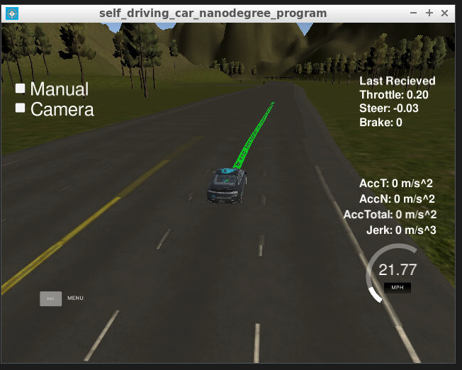
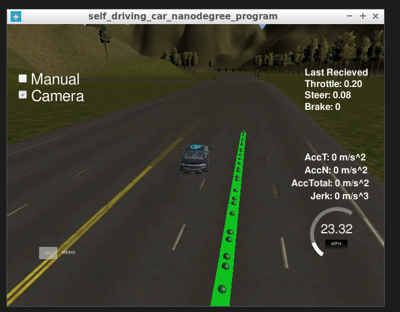

# Final Capstone project

### Team

I was an army of one. I did not have a team for this project because I had to take care of work related topics and ended up having to do the project after the deadline...which was far too late to find a team; therefore, I implemented all parts by myself.

**Name**: Nicholas Atanasov, nick.atanasov1@gmail.com

**I do not care to try my code on Carla, I just want to pass the course**

**ISSUE I AM HAVING**: Everytime I turn the camera on, my car drifts away. I am not subscribing to the camera in my waypoint updater, tl_detector, or dbw nodes. I am able to stop at lights and navigate around the track without camera turned on but cannot with the camera on. Please advise.

### NO CAMERA

     
     
### CAMERA

